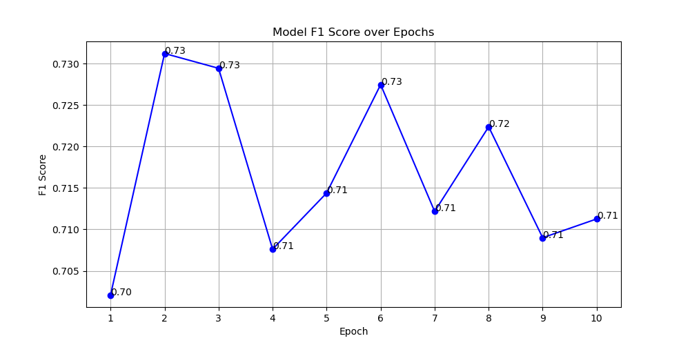

# 多模态情感分析 实验报告

- 10215501403 沈桐乐

## 简介

本次实验需要解决的是一个多模态分类任务。采用的基座模型是**FLAVA**，通过设计**数据重采样**算法，**冻结层数微调**，通过**三层MLP和全局token传入监督信号**，使得最终验证准确率达到了0.73, f1值为0.73

当前设计下的主要制约因素是FLAVA模型的**预训练**开源checkpoint不足，使用特定情感预训练任务，会使得模型的性能显著提升。然而受制于设备因素，本次实验无法在个人主机上进行预训练

本实验报告主要包含以下几个部分：

- 数据预处理，重采样
- 模型讲解，分类器设计讨论，冻结层数选取，和其他模型技术细节
- 实验结果，消融实验
- 废弃设计讨论
- 总结和改进空间

## 数据集

本次实验的数据集是一个多模态情感分析（Multimodel Sentiment Analysis）数据集，一个经典的下游任务。其包含两个模态：文本和图像。标签为中立，负面和正面

### 数据预处理

首先我发现数据中，文本字段拥有部分乱码，而且其中包含很多带“#”的tag标签，为了统一成单词序列，我去掉了**非字母部分**，以及统一所有输入作为小写

FLAVA模型拥有自带的text encoder和image encoder，因此不需要额外的模型做embedding。

但是，由于数据长度的不同，对于text和image，仍然需要做padding操作，即通过加入padding和mask对齐输入，使得数据可以通过一个batch传入给模型

### 重采样

经过统计，标签部分是**数量少且不平衡**的，其中negative: 1193条，neutral：419条，positive：2388条。如果不作任何处理，直接把数据放入模型中训练，**会导致模型不收敛**。

经过不断尝试，我发现**重采样**策略能够消除数据不平衡带来的负面影响。而weighted cross entropy无法解决这个问题。重采样步骤也就是：根据标签出现的频率取倒数，依照三个标签的不同概率，重新抽取对应数据集

重采样带来的优点有：打破标签强烈不平衡的影响，缺点就是增加训练负担，因为少部分的数据会被不断采样，实际实验中，训练数据集被扩大至将近1.8-1.9倍

## 模型设计

考虑到个人硬件配置，采用的是BERT时代的主流设计，也就是先通过静态的Text Embedding和Image Embedding，把两者结合后放入一个BERT模型，通过MLM，MIM等预训练任务进行预训练，最后用基座模型对下游任务进行微调

### 基座模型选取

传统的基座模型基本采用上文的设计范式，只是模态联合训练的策略不同。如CLIP采用交叉Token的内积进行联合，而BERT一派通过简单的embedding连接法，比如VisualBERT，TomBERT等，通过跨模态注意力机制进行训练。从效果上看，后者占略微优势，然而在参数量上BERT要远远超过CLIP流派的模型。

我采用的是沿用BERT设计的FLAVA模型。

该基座模型的主要思想是：通过BERT-Encoder，以文本和图像为输入，预训练一个**Multimodel Encoder**，把三者联合进行注意力学习，最终输出三者的Embedding。该设计在文本-图像对齐任务上有不错的提升。其架构图如下：


我发现使用该模型的另一个好处是：专门针对融合模型预训练的Encoder，能够让模型的输入变得容易。不需要下载额外的Embedding模型，不需要做张量放缩对齐，而且，传统的静态Embedding+BERT的模型，如果使用的Embedding模型和论文中的不相同，会让预训练失效。FLAVA在这一点上的便捷度十分显著。

### 分类器设计

拥有了三个embedding的输出，把监督信号传入基座模型，需要对模型的输出链接到损失函数。

通过不断的调整，我获得的经验是：**降低分类器深度**，保持分类器尽可能简单。分类器过于复杂，很容易导致模型过拟合，起不到对应的效果。而且深度过大，连接输出token过多往往会损失监督信息。

所以，借鉴BERT下游分类任务的设计，我采用了FLAVA模型，multimodel embedding的第一个Global token作为基座模型的端点，通过3层MLP和Dropout来保证监督信号尽可能传入到基座模型当中：
```py
class FlavaForClassification(nn.Module):
    def __init__(self, num_labels=3, dropout=0.3, freeze_layers = 1):
        super().__init__()
        self.flava = FlavaModel.from_pretrained("facebook/flava-full")

        if freeze_layers > 0:
            self.freeze_flava_layers(freeze_layers)

        embedding_size = self.flava.config.hidden_size

        self.multimodal_attention = self.create_attention_layer(embedding_size, dropout)

        self.classifier = nn.Sequential(
            nn.Linear(embedding_size, embedding_size), # First layer
            nn.ReLU(),
            nn.Dropout(dropout),
            nn.Linear(embedding_size, embedding_size // 2), # Second layer
            nn.ReLU(),
            nn.Dropout(dropout),
            nn.Linear(embedding_size // 2, num_labels) # Output layer
        )
        
def forward(self, inputs):
        outputs = self.flava(**inputs)
        multimodal_embeddings = outputs.multimodal_embeddings
        global_token_embeddings = multimodal_embeddings[:, 0, :]
        logits = self.classifier(global_token_embeddings)
        return logits
```

### 冻结层数

运用以上策略，训练模型还是无法收敛。由于FLAVA的text encoder和image encoder是动态的，这意味着反向传播计算过程中，两个encoder也会被加入计算图当中，实验中出现了严重的**灾难性遗忘**

我采用的解决方法是**冻结层数**，也就是说，encoder模型中默认前几层是不需要更改的。实验中我冻结了全部的text和image encoder，但是没有冻结multimodel encoder（冻结这些层数会显著降低模型表现）

```py
def freeze_flava_layers(self, freeze=1):
        # Freeze specific layers or components
        for param in self.flava.text_model.parameters():
            param.requires_grad = False
        
        for param in self.flava.image_model.parameters():
            param.requires_grad = False
```

这样做直接解决了灾难性遗忘的问题，而且收敛速度加快，验证准确率显著提升

## 实验结果

### 实验配置

学习率为0.0001，使用Adam优化器，dropout为0.3，普通的Cross Entropy Loss作为损失函数，batch size为32，10个epoch

由于resampling，一个epoch包含190个左右的batch（原始为100个），而验证集不采用resampling策略，而是直接预测。训练/验证划分为：8/2，通过准确率和F1值评价模型表现

最终实验的硬件配置为：GPU：A100-PCIE-40GB

### 实验结果

- 损失下降图


- 准确率


- F1值



### 结果分析

模型在2-3个epoch，以及6epoch时表现最佳。说明了微调任务不宜过度，否则出现了过拟合

通过冻结层数，resampling和分类器设计，模型收敛速度极快。其最终的准确率较高，但和论文中提到的分类任务还相差5个点。这个差异主要来源于：

- 任务不同，可能MSA更关注情感多一些，论文中的分类任务和情感无关
- 和预训练信息有所不同。简单的MLM，MMM任务是海量的文本-图像补全，其中包含情感类信息较少
- 预训练模型的选择较少。我发现Text和Image的Encoder对实验的效果影响不大，但是一旦冻结了Multimodel Encoder，模型开始降低性能。而理论上这样做反而会提升模型的性能，这可能源于该模型还是比较冷门的，目前我只找到了原始论文和Meta公司提供的预训练完的版本，不像其他的BERT模型有很多选择

### 消融实验

通过掩码，把文本和图像的Input设置为全0来输入给模型进行unimodel test，实验结果如下

|                 | Accuracy | F1 score |
| --------------- | -------- | -------- |
| FLAVA w/o image | 0.63     | 0.62     |
| FLAVA w/o text  | 0.70     | 0.70     |
| FLAVA           | **0.73** | **0.73** |

可以观察到，去掉文本模态对结果的影响较小，而去掉图像对结果影响很大，说明图像占据分类因素很大一部分，其包含关键信息更多

## 废弃设计讨论

在选取FLAVA模型之前，我还尝试了使用VisualBERT和CLIP做多模态情感分析。之所以不采用VisualBERT，就是因为前面提到的Encoder的原因。我选用了resnet50作为图像的特征提取，而论文使用的是R-CNN，导致预训练失效。而单一Encoder的使用，会导致特征提取中，图像特征的关注点和文本模态没有对齐。这也是早期多模态任务使用联合注意力机制的主要改进目标。

对于CLIP来说，其交叉内积的设计策略，使得寻找单个token和单块图像特征更加方便，但是尝试之后在该任务上表现一般，我觉得也是源于其架构不如联合注意力机制带来的效果更好。所以最终弃用该模型。

在分类器的选择上面，我其实做了更多的尝试，比如采用早期多模态论文的常用设计：对所有token做softmax后**加权求和**，作为基座模型的输出，以及对文本embedding，图像embedding同样加权输出，与基座模型（FLAVA中是multimodel encoder）**连接** 扔给分类器。以及把这三者连接后，用多层的multihead attention来替代MLP。

**但是**，这些设计都不如直接取一个基座模型的Global Token，用线性分类器或者2-3层的MLP直接传递监督信号，而且效果差距明显（大概7-8%）。我觉得原因是对于这个数据集的监督信号是不足的，应该让其**快速地传递给基座模型**，而不是在分类器上做文章。基座模型的跨模态注意力能够更有效地利用非常稀缺的信号。

最后，之所以采用resampling，而不是比如加权的CE loss，这其实是一个统计学的原理。尽管两者的期望loss是一致的，对于稀疏标签来说，resampling会让其出现频率更高，但是weighted CE loss不会，这会导致该标签的信息不易被训练到，而更频繁的标签被注意到的次数更多。在结果上，稀疏标签的方差会很大，导致模型依然无法收敛。

## 参考文献

- [**FLAVA: A Foundational Language And Vision Alignment Model**](https://arxiv.org/abs/2112.04482)(paper)

- [**What Would Elsa Do? Freezing Layers During Transformer Fine-Tuning**](https://arxiv.org/abs/1911.03090)(paper)

- [**Data Selection for Language Models via Importance Resampling**](https://arxiv.org/abs/2302.03169)(paper)

- [**Open source FLAVA document on HuggingFace**](https://huggingface.co/docs/transformers/model_doc/flava)(website)
